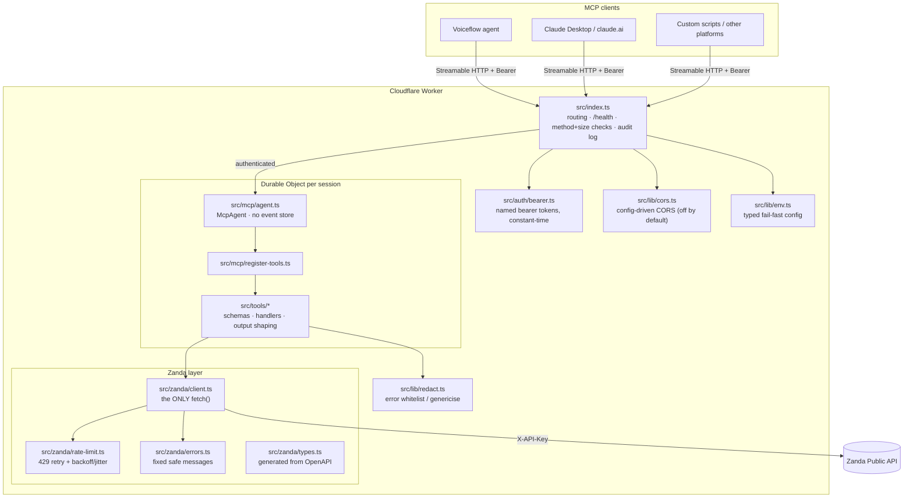

# Architecture

A remote MCP server on Cloudflare Workers exposing the Zanda Health Public API as read-only
MCP tools. The design goal is that every security property is enforceable by pointing at one
file.

## The layers



## The dependency rule

One direction only:

```
index.ts → auth → mcp → tools → zanda
```

- **`src/index.ts`** knows about auth, CORS, env, and the MCP handler. Nothing knows about it.
- **`src/auth/`** knows nothing about MCP or Zanda.
- **`src/mcp/`** (agent + registration) knows about tools, never about HTTP routing or auth.
- **`src/tools/`** know the `ZandaReader` interface and shared helpers. They never call
  `fetch`, never see the API key, never know a bearer token exists.
- **`src/zanda/`** knows only Zanda. `client.ts` is the single file allowed to call `fetch()`
  to the outside world — one place to attach the key, one place to audit, one thing to mock.
- **`src/lib/`** (env, cors, redact) is shared plumbing with no dependencies on other layers
  (redact knows the error *types* of zanda/env by design — it is the whitelist).

Anything violating the arrow direction (a tool importing from `src/auth/`, the Zanda client
importing from `src/mcp/`) is a design bug, regardless of whether it works.

## One request, end to end

`POST /mcp` (tool call `list_clients`) → `index.ts` (method + size checks, config, bearer gate;
401/405/413 exit here) → agents SDK routes by `mcp-session-id` to the session's Durable Object →
`agent.ts`'s `McpServer` validates arguments against the Zod shape (`tools/schemas.ts`) →
handler in `tools/clients.ts` runs inside `runTool` (`tools/output.ts`) → `zanda/client.ts`
builds the URL, attaches `X-API-KEY`, fetches with 429 retry (`rate-limit.ts`), unwraps the
`data`/`items` envelope → handler curates fields, prefixes a `summary` → back out through the
Durable Object → `index.ts` logs `client=<token name> method=POST status=200 ms=…` and applies
the CORS policy → client. Any failure anywhere inside the handler exits through
`lib/redact.ts` as a safe message.

## Why a Durable Object?

MCP sessions are stateful conversations (handshake, session ID, open streams) but Workers are
stateless. The `agents` SDK parks each session's protocol state in its own Durable Object so
any Worker instance can serve request N of a session. Ours stores protocol bookkeeping only:
the SDK's stream-resumability event store — which would transiently buffer response payloads —
is disabled in `agent.ts` (see SECURITY.md, "What the server itself stores").

## Security invariants (enforced, not aspirational)

| Invariant | Enforced by |
|---|---|
| Zanda key attached in exactly one place | `zanda/client.ts` request(); grep `fetch(` to audit |
| Clients never see Zanda credentials | Two-credential model; layers above zanda/ have no key access |
| Every tool input validated before Zanda | Zod shapes run by the MCP SDK; cross-field checks in handlers |
| No personal data in logs | 5 `console.*` sites, all enum/name/status/timing; `lib/redact.ts` for errors |
| No personal data at rest | No KV; event store disabled in `mcp/agent.ts` |
| Errors can't leak internals | Fixed messages (`zanda/errors.ts`) + whitelist (`lib/redact.ts`) + generic 500 (`index.ts`) |

Tests pin each invariant — see `test/` (notably `hardening.spec.ts` and the tripwire tests in
`test/tools/` and `test/redact.spec.ts`).
